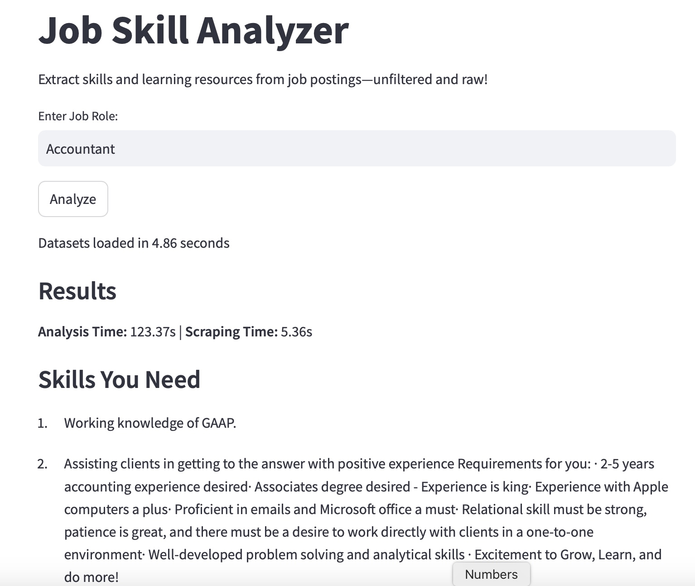

# Job Skill Analyzer

**A Python-powered tool to extract actionable skills from ~200 MB of job postings and deliver tailored learning resources.**



## Overview
This project turns raw job data into career gold:
- **Skill Extraction**: Mines nearly 200 MB of job postings with NLP to pinpoint must-have skills (e.g., "Experience with cloud technologies such as AWS, GCP").
- **Learning Resources**: Scrapes Coursera for courses to master job related skills fast.
- **Modern Interface**: Streamlit-driven web UI—intuitive, polished, and built for impact.

## Motivation
I built this to decode real-world job requirements and map them to actionable learning paths, it is built off of legally sourced Kaggle datasets instead of scraping platforms like LinkedIn. It’s about cutting through the noise of job boards with tech that delivers.


## Technology Stack
- **Python**: Core engine for robust, scalable logic.
- **Streamlit**: Web frontend that’s sleek and user-friendly.
- **spaCy**: NLP framework for precise skill extraction and filtering.
- **Selenium**: Automated scraping of Coursera resources.
- **pandas**: Handles ~200 MB of preprocessed job data with ease.

## Installation
1. Clone the repository:
   ```sh
   git clone <https://github.com/dave22r/JobSkillAnalyzer>
   cd job-skill-analyzer

## Setup

1. Install dependencies:  
   ```sh
   pip install -r requirements.txt
   ```
2. Run the application:  
   ```sh
   python main.py
   ```
## Usage
- A single small dataset of job postings in canada "linkedin_canada.csv" can be found in this repository and can be used for testing purposes.


- The original project was done using ~200 mb of CSV files which can't be uploaded but are linked here:
- https://www.kaggle.com/datasets/arshkon/linkedin-job-postings

- https://www.kaggle.com/datasets/adampq/linkedin-jobs-machine-learning-data-set

- Once the datasets are downloaded, their file path can be mentioned in the ```DATASETS``` variable in ```dataset_loader.py```


## Features

- Loads job postings from datasets
- Extracts skills using NLP (Natural Language Processing)
- Displays skill-related sentences
- Provides a list of most common skills


----------------------------------------------------------------------------------------------
Built on publicly available job posting datasets from Kaggle
